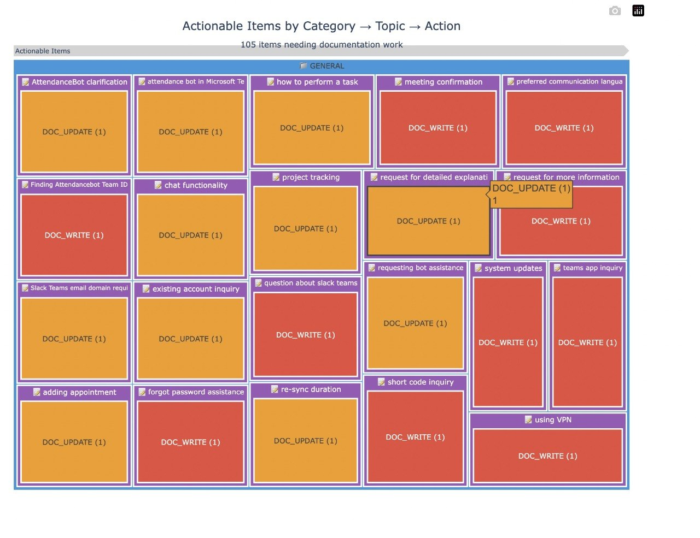

# RAGTriage

Turn your RAG failures into a prioritized backlog for your documentation team.

## The Problem

You have a RAG system answering support queries. Existing evaluation tools (Ragas, DeepEval, etc.) give you metrics like "faithfulness: 0.72". You don't know what to do with that number.

You need to know:
- Which queries were answered well
- Which ones failed
- Why they failed  
- What your team should write or fix next

## What RAGTriage Does

Given a dataset of support queries and your RAG system's responses, RAGTriage:

1. **Evaluates** each answer across 5 dimensions (correctness, completeness, context usage, clarity, conciseness)
2. **Classifies** queries into lanes:
   - **UNDERSTANDING**: User wants to know how to do something
   - **INCIDENT**: User reports something is broken
   - **SPAM**: Marketing pitches, gibberish
3. **Identifies action items** for partial answers:
   - **DOC_WRITE**: Write a new article (no relevant context found)
   - **DOC_UPDATE**: Update existing article (context exists but answer incomplete)
4. **Generates** a prioritized report for your CS team

## Example Output

```
Total queries: 100
Understanding queries: 85 (85%)
  - Well answered: 58 (68%)
  - Partial answer: 27 (32%)

Action items: 27
  - Write new article: 5 (19%)
  - Update existing: 22 (81%)

Top articles to write:
1. How to Cancel Your Subscription (3 questions)
2. API Authentication Guide (2 questions)

Top articles to update:
1. How to Set Up Auto-Punch (4 questions)
2. Leave Policy Configuration (3 questions)
```

## Installation

```bash
# Clone the repository
git clone https://github.com/AnaekBackend/ragtriage
cd ragtriage

# Install with uv
uv sync

# Or with pip
pip install -e .
```

## Quick Start

1. **Set your OpenAI API key:**
   ```bash
   echo "OPENAI_API_KEY=sk-*** > .env
   ```

2. **Choose your workflow:**

   **Option A: Full evaluation with actionable insights** (Recommended)
   ```bash
   # Evaluates queries + clusters actionable items by Category → Topic → Action
   uv run ragtriage-eval --cluster -i your_queries.jsonl
   ```

   **Option B: Quick clustering** (No LLM needed)
   ```bash
   # Fast semantic clustering of all queries
   uv run ragtriage-cluster -i your_queries.jsonl
   ```

3. **View results:**
   ```bash
   cat output/report.md
   open output/action_items.csv  # In Excel/Sheets
   open output/treemap.html      # Interactive visualization
   ```

## Using Your Own Data

Create a JSONL file with your RAG queries and responses:

```json
{"query": "How do I cancel my subscription?", "contexts": ["context1...", "context2..."], "generated_answer": "To cancel, go to Settings..."}
{"query": "Why is my timesheet not working?", "contexts": [], "generated_answer": "I'm not sure about that..."}
```

Then run:
```bash
uv run eval --input your_data.jsonl --output-dir my_results
```

## How It Works

### Step 1: Evaluation

Each query is scored across 5 dimensions (1-5 scale):
- **Correctness**: Is the information accurate?
- **Completeness**: Does it answer the full question?
- **Context Usage**: Does it use retrieved contexts effectively?
- **Clarity**: Is it easy to understand?
- **Conciseness**: Is it appropriately brief?

Overall score < 3 = "partial answer"

### Step 2: Lane Classification

Queries are classified into:
- **UNDERSTANDING**: How-to, setup, configuration questions
- **INCIDENT**: Bug reports, data issues, "not working"
- **SPAM**: Sales pitches, unrelated content

Only UNDERSTANDING queries with partial answers proceed to action classification.

### Step 3: Action Classification

For partial understanding queries:
- **DOC_WRITE**: No relevant contexts retrieved → likely need new article
- **DOC_UPDATE**: Relevant contexts exist but answer incomplete → enhance existing article

Note: Without your full document library, "DOC_WRITE" means "no relevant context was found" which could mean the doc doesn't exist OR your RAG failed to retrieve it. Both are actionable.

### Step 4: Clustering & Visualization

Queries are grouped semantically to identify patterns:

**Pre-Evaluation Clustering** (`ragtriage-cluster` without eval results):
- Clusters ALL queries (understanding + incident + spam)
- Groups by semantic similarity only
- Useful for: Initial data exploration, identifying query themes
- No OpenAI API key required

**Post-Evaluation Clustering** (`ragtriage-eval --cluster` or with cached eval results):
- Clusters only actionable UNDERSTANDING queries with partial answers
- Hierarchical grouping: **Category** → **Topic** → **Action** (DOC_WRITE/DOC_UPDATE)
- Useful for: Prioritized backlog for documentation team
- Generates interactive treemap:



### Step 5: Reporting

Results are compiled into:
- `report.md`: Executive summary with statistics and top issues
- `action_items.csv`: Detailed spreadsheet for CS team
- `treemap.html`: Interactive visualization of actionable items
- `analyzed_results.json`: Full data for custom analysis

## Commands

RAGTriage provides two CLI commands for different use cases:

### `ragtriage-eval` - Full Evaluation Pipeline

Runs the complete analysis: evaluation → classification → action detection → (optional) clustering

```bash
# Basic evaluation (Steps 1-3)
uv run ragtriage-eval -i queries.jsonl

# Full pipeline with clustering and visualization (Steps 1-5)
uv run ragtriage-eval --cluster -i queries.jsonl

# Re-run analysis using cached evaluation results
uv run ragtriage-eval -i queries.jsonl  # Skips Step 1 if evaluation_results.json exists

# Force re-evaluation from scratch
uv run ragtriage-eval --refresh -i queries.jsonl
```

**Outputs:**
- `evaluation_results.json` - Step 1 scores (cached)
- `analyzed_results.json` - Steps 2-3 classifications and action items
- `report.md` - Human-readable summary
- `action_items.csv` - Spreadsheet for CS team
- `clustering_results.json` + `treemap.html` - (with `--cluster`)

### `ragtriage-cluster` - Standalone Clustering

Fast semantic clustering without LLM evaluation. Useful when you just want to explore query patterns.

```bash
# Quick clustering without evaluation (no OpenAI key needed)
uv run ragtriage-cluster -i queries.jsonl

# Cluster using cached evaluation results (actionable mode)
uv run ragtriage-cluster -i queries.jsonl  # Auto-detects eval_results.json
```

**Behavior depends on available data:**
- **Without eval results**: Pre-evaluation clustering — groups ALL queries semantically
- **With eval results**: Post-evaluation clustering — groups only actionable items hierarchically

**When to use which:**

| Use Case | Command | Cost | Time |
|----------|---------|------|------|
| Full actionable backlog for docs team | `ragtriage-eval --cluster` | ~$0.01/query | ~2s/query |
| Re-generate report from cached evals | `ragtriage-eval` (no --refresh) | Free | Seconds |
| Quick exploration of query themes | `ragtriage-cluster` | Free | Seconds |
| Update clustering after eval changes | `ragtriage-cluster` | Free | Seconds |

## Real-World Results

We built RAGTriage while evaluating support queries for AttendanceBot (a B2B SaaS time tracking product).

From 100 sample queries:
- 85 were genuine understanding questions
- 58 (68%) were answered well by RAG
- 27 (32%) got partial answers
- 22 needed existing docs updated
- 5 needed new articles written

The tool helped identify that cancellation documentation was missing (multiple users asking) while auto-punch docs needed enhancement (context existed but answer incomplete).

## Configuration

Environment variables:
- `OPENAI_API_KEY`: Required. Used for LLM-based evaluation and classification.
- `OPENAI_MODEL`: Optional. Default: `gpt-4o-mini`

## Data Format

Input JSONL fields:
- `query` (required): User's question
- `contexts` (required): List of retrieved context strings
- `generated_answer` (required): Your RAG system's response

Output files:
- `evaluation_results.json` - Step 1 scores (cached for resumability)
- `analyzed_results.json` - Full analysis with classifications and action items
- `report.md` - Executive summary
- `action_items.csv` - Spreadsheet for CS team
- `treemap.html` - Interactive visualization (with `--cluster`)
- `clustering_results.json` - Cluster assignments and metadata

Output JSON fields (additional):
- `evaluation.scores`: 5-dimension scores
- `evaluation.overall_score`: Average score
- `evaluation.bucket`: well_answered, partial, content_gap
- `lane`: UNDERSTANDING, INCIDENT, SPAM
- `category`: BILLING, LEAVE, TIMESHEET, etc.
- `action`: DOC_WRITE, DOC_UPDATE, N/A
- `target_article`: Suggested article name

## Limitations

- Requires OpenAI API key (LLM-based evaluation)
- Costs ~$0.01-0.02 per query evaluated
- "Content gap" classification is conservative (flags when no relevant context found, which could be retrieval failure)
- Works best with English queries

## License

MIT

## Contributing

See CONTRIBUTING.md
